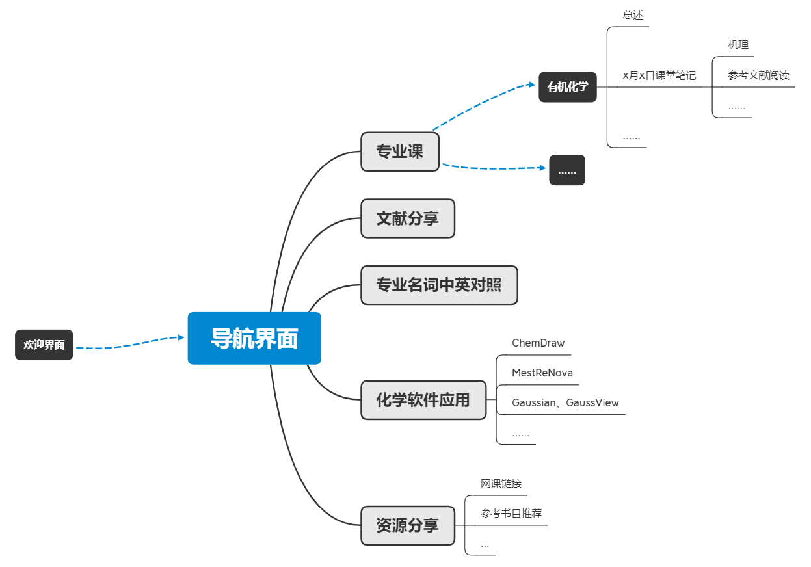

# ChemDim
## 目录
1.项目简介/目标

2.项目结构

3.网站各版块功能

4.声明
## 1.项目简介
本项目（原名*DK_Chemistry_Website*）ChemDim，意为Chemistry Dimension（化学维度），当前定位为一个web静态网站开源项目，由苏州大学材料与化学化工学部2020级本科生开发，旨在满足学生对于专业课的**知识点梳理**、**课堂笔记归纳**、**文献整理**、**资料共享**、**化学软件的使用技巧**等的需求，力求打造一个轻量、便捷、有效的学习园地。

后期项目将上线bbs论坛功能，旨在提升的学术交流的氛围，打造一个小型的、简洁的、自由的沉浸式轻量学术交流平台，期待碰撞出灿烂的火花。

## 2.项目结构

页面布局分为：欢迎界面、导航界面、具体专栏

## 3.网站各版块功能

- **专业课**

本栏目收录上课时教授授课的重点笔记、思维导图以及所提及知识点的拓展文献，专业课从**2021年秋季学期**至**2021年秋季学期**有：有机化学、分析化学、有机化学实验、分析化学实验
- **文献分享**

本栏目共享目前热点或者新颖的课题研究成果，摘选自各大期刊
- **专业名词中英对照**

本栏目整理常见化学专业名词的中英文对照，这是考虑到阅读英文文献需要一定的单词储备
- **化学软件应用**

本栏目介绍在化学科研过程中常见的软件的使用方法，包括但不限于ChemDraw、MestReNova、Gaussian/GaussView
- **资源分享**

本栏目整理优质化学学习资源，包括但不限于视频、图像、文档

## 4.声明
本项目于2021年9月28日启动，目前由发起人DanteKing进行前期开发。任何对本项目感兴趣的朋友可以通过邮箱联系开发者。项目遵循GNU3.0协议，拥抱开源，让知识的传递没有边界。

DanteKing

2021.9.29
